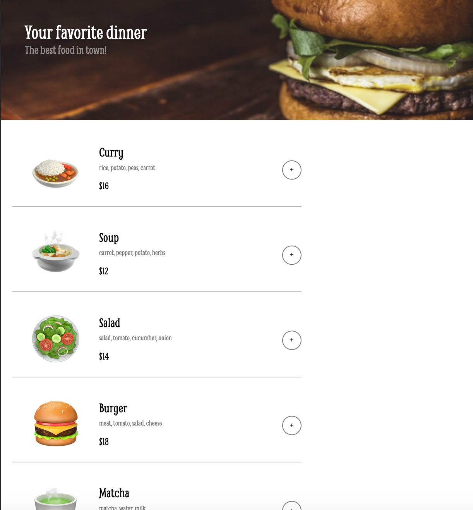
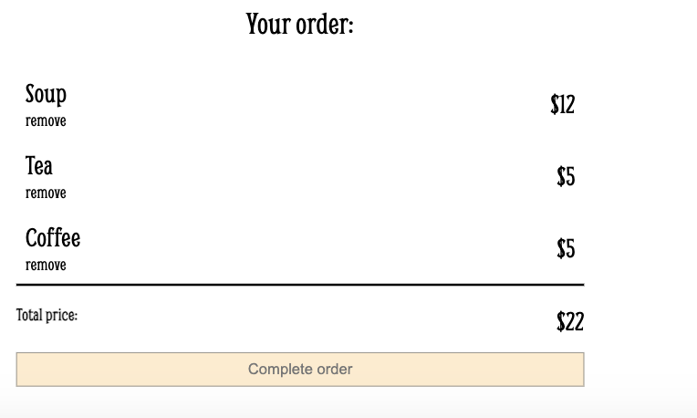
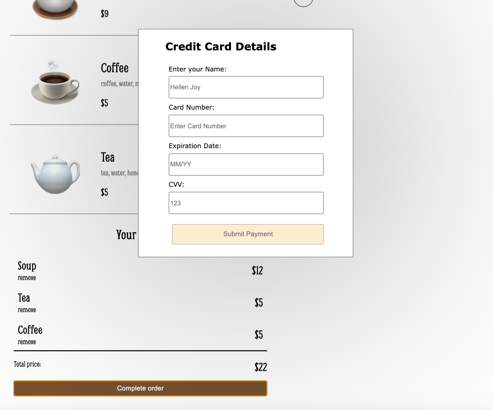
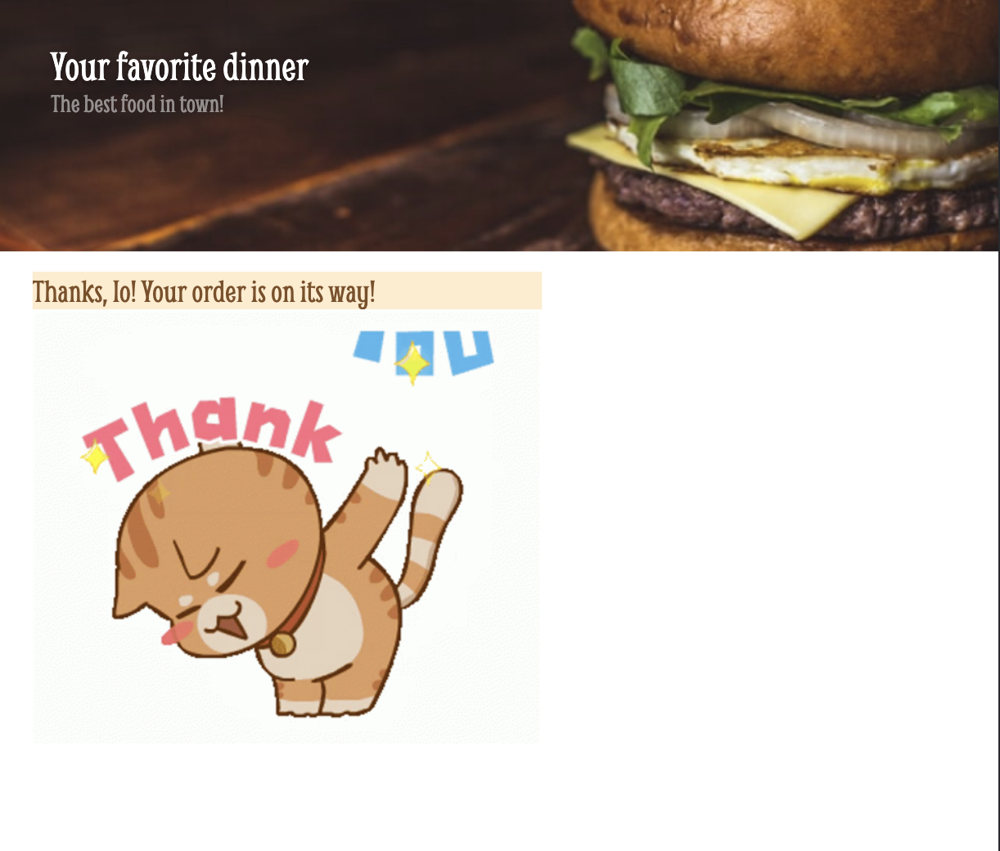

# Restaurant-Ordering-App
## Table of contents

- [Overview](#overview)
  - [The challenge](#the-challenge)
  - [Screenshot](#screenshot)
- [My process](#my-process)
  - [What I learned](#What-I-learned)

## Overview

https://io-restaurant-ordering-app.netlify.app

### The challenge

Restaurant Ordering App 

### Screenshot

## My process

- Render the menu options using JS 
- Be able to add/remove items as order
- Have a payment form inputs
- Render a thank you message

### What I learned

- import/export data 
- forEach
- Data atributes 
- .filter()
